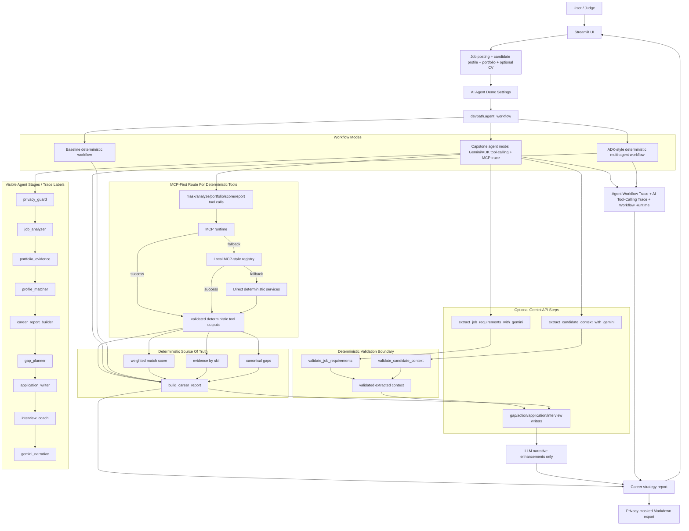

# DevPath Agent

DevPath Agent is an AI Career Copilot for junior software developers. It analyzes a job posting, candidate profile, project portfolio, and optional CV context, then produces a deterministic match score, evidence-based gaps, a preparation plan, application drafts, interview prep, and optional Gemini-assisted narrative insights.

Built for Kaggle's **AI Agents: Intensive Vibe Coding Capstone Project with Google**, the project fits the **Concierge Agents** track: it gives one developer a practical, personalized career strategy while keeping scoring explainable and personal data handling cautious.

Public repository: https://github.com/kranel-argonavt/devpath-agent

## Problem

Junior developers often struggle to translate broad job postings into a concrete preparation plan. Requirements are mixed with nice-to-have skills, seniority signals, language expectations, and vague responsibilities. Candidate evidence is also scattered across profile notes, CV text, and portfolio projects.

DevPath Agent turns that comparison into a structured, explainable workflow that helps a junior developer decide what to highlight, what to improve, and how to prepare before applying.

## Current Architecture



The deterministic report remains the source of truth. Gemini can extract structured context and enrich narrative sections when configured with a local API key, but deterministic validators and scoring tools preserve canonical score, evidence, and gap fields.

## Current Status

Current status: **Agent Runtime Upgrade - capstone-grade tool-calling demo mode.**

Implemented:

- Streamlit mock workflow UI
- Editable job posting, candidate profile, portfolio source, CV context, and analysis settings
- Deterministic evidence-based match scoring
- Category score breakdown and category reasons
- Strong, partial, and missing skill classification
- Evidence by skill and portfolio evidence map
- Prioritized skill gaps with recommendations
- Preparation plan, application drafts, and interview prep
- Rich privacy-masked Markdown export
- Optional Gemini-assisted structured extraction and richer narrative writers
- Google ADK-compatible `root_agent` skeleton and sub-agent definitions
- Deterministic agent tools
- MCP-compatible server skeleton and MCP-style tool registry
- MCP tools for local profile/project loading, portfolio summary, privacy detection/masking, export, scoring, public GitHub repository metadata, and public README fetch
- Demo workflow selector for capstone tool-calling, ADK-style deterministic workflow, or baseline deterministic workflow
- Backend comparison selector for non-capstone deterministic routes
- Experimental MCP stdio runtime adapter for selected manual tool calls
- Local MCP runtime smoke test succeeds with selected deterministic tools
- Experimental ADK-MCP bridge wrappers for selected deterministic tools
- Experimental ADK-MCP runtime tool backend with safe direct fallback
- Workflow runtime metadata in the UI and exported Markdown
- GitHub public repository metadata import as a portfolio source
- GitHub public repository metadata mapped into portfolio evidence
- Controlled public GitHub README fetch helper for explicit MCP/API use
- Full ADK-style deterministic agent workflow with named stages and trace metadata
- Streamlit `Demo workflow` selector for Gemini/ADK tool-calling, full agent workflow, or standard workflow mode
- Agent Workflow Trace display in Streamlit and exported Markdown
- AI Tool-Calling Trace display in Streamlit and exported Markdown
- Capstone-ready demo defaults: Gemini/ADK tool-calling, Gemini-assisted summary with safe fallback, deterministic scoring, local sample projects
- Local Gemini, ADK, and MCP smoke-test scripts
- Pytest suite for deterministic helpers, workflow, tools, and smoke scripts

Not implemented yet:

- Live ADK runtime routing in Streamlit
- Production ADK Agent Engine deployment
- GitHub source-code evidence mapping
- GitHub private repository access
- Source-code repository inspection beyond controlled public metadata and explicit README fetch
- Production deployment

## Agent And Tool Layers

- `devpath/agent.py` exports an ADK-compatible `root_agent` skeleton.
- `devpath/sub_agents/` contains planned specialized agents for job analysis, portfolio evidence, matching, gap planning, application writing, interview coaching, and privacy review.
- `devpath/agent_tools.py` exposes deterministic tool wrappers for future agent orchestration.
- `mcp_server/server.py` exposes an import-safe MCP server skeleton or fallback metadata.
- `mcp_server/tools/` contains MCP-style wrappers around deterministic project logic, local sample readers, privacy tools, export, and controlled public GitHub lookups.
- `devpath/tool_router.py` lets the workflow use direct deterministic services, the local MCP-style registry in-process, or experimental ADK-MCP runtime wrappers.

Streamlit now includes a capstone demo mode named `Gemini/ADK tool-calling agent`. It runs the career workflow through visible tool calls, requests MCP runtime first, falls back to the local MCP-style registry, and finally falls back to direct deterministic services. Streamlit still does **not** depend on a deployed ADK runtime; the route is intentionally local, testable, and safe for judging.

## Gemini/ADK Tool-Calling Mode

The default demo workflow is `Gemini/ADK tool-calling agent`. It records an `AI Tool-Calling Trace` for:

- `mask_personal_data`
- `extract_job_requirements_with_gemini`
- `validate_job_requirements`
- `analyze_job_posting`
- `build_portfolio_summary`
- `extract_candidate_context_with_gemini`
- `validate_candidate_context`
- `calculate_match_score`
- `build_career_report`
- `generate_gap_narrative`
- `generate_action_plan_narrative`
- `generate_application_drafts`
- `generate_interview_prep`
- `generate_gemini_career_insights`

Each trace entry shows the tool name, agent name, backend used, status, input summary, output summary, fallback status, and warnings. The preferred backend is MCP runtime. If MCP runtime is unavailable, the workflow falls back to the in-process MCP-style registry, then to direct deterministic Python services.

Gemini is enabled by default for bounded structured extraction and narrative writing, but it is optional at runtime. Gemini may extract job/profile/CV facts and may enhance narrative sections for Gaps, Action Plan, Application, and Interview. Deterministic validators normalize or reject Gemini output, deterministic tools still calculate the canonical score/evidence/gaps, and Gemini cannot overwrite numeric score fields. If `GOOGLE_API_KEY` is missing or Gemini fails, the report is still generated and Gemini tool-calls are marked as skipped or fallback.

## Full Agent Workflow Orchestration

The project includes a full ADK-style deterministic workflow facade in `devpath/full_agent_workflow.py`. Streamlit can run the standard deterministic workflow or the full agent workflow through the `Demo workflow` selector. The full workflow runs the career strategy process through named stages:

- `privacy_guard`
- `job_analyzer`
- `portfolio_evidence`
- `profile_matcher`
- `gap_planner`
- `application_writer`
- `interview_coach`

These stages orchestrate existing deterministic tools and services, produce an agent trace, and attach workflow metadata to the report. The UI displays `Agent Workflow Trace`, and Markdown export includes the same trace when present. Deterministic scoring remains the source of truth; agents must not invent or modify numeric match scores.

## Capstone Fit

Recommended track: **Concierge Agents**.

Course concepts demonstrated:

- ADK-style multi-agent workflow with root agent, staged sub-agent responsibilities, and visible tool-calling mode
- MCP server skeleton, MCP-style tools, local registry, MCP runtime adapter, and MCP-first tool-calling route with fallback
- Security and privacy features, including masking and no-secret export rules
- Agent tools and deterministic tool contracts for scoring, privacy, report, GitHub evidence, and export
- Deployability and reproducible setup through requirements, Dockerfile, smoke scripts, and tests
- Optional Gemini structured extraction and narrative writers that never modify deterministic scores
- Antigravity / AI-assisted vibe coding can be shown in the final video build story

## Demo Flow

Default offline path:

1. Click `Load sample React frontend scenario`.
2. Keep the default `Capstone agent mode: Gemini/ADK tool-calling + MCP trace` and `Local sample projects`.
3. Click `Generate Career Strategy`.
4. Show Match Score, Evidence, Gaps, Agent Workflow Trace, AI Tool-Calling Trace, Workflow Runtime, and Markdown export.

Optional custom-input path: switch Portfolio to `Manual JSON input`, paste a project array, and generate a report without relying on GitHub.

Optional GitHub path: switch Portfolio to `GitHub public repositories`, enter a public username, fetch repositories, and show GitHub Repository Evidence.

## Setup

### 1. Clone the Repository
Open your terminal (Command Prompt or Git Bash) and run the following commands to clone the project and navigate into its folder:
```bash
# Clone the repository
git clone https://github.com/kranel-argonavt/VocabTrainer.git

# Move into the project directory
cd devpath-agent
```

### 2. Open PowerShell and Run Setup
Now, open **PowerShell** inside the project folder and execute the following steps to set up the application:

#### A. Create and Activate Virtual Environment
```powershell
# 1. Create a virtual environment named .venv
python -m venv .venv

# 2. Temporarily bypass Execution Policy to allow script execution in this session
Set-ExecutionPolicy -Scope Process -ExecutionPolicy Bypass

# 3. Activate the virtual environment
.\.venv\Scripts\Activate.ps1
```

#### B. Install Dependencies
```powershell
# Upgrade pip to ensure smooth package installation
python -m pip install --upgrade pip

# Install all required packages
pip install -r requirements.txt
```

### 3. Environment Configuration
Before launching the app, configure your API keys:
1. Duplicate the template file: copy `.env.example` and rename it to `.env`.
2. Open `.env` in your text editor and insert your Gemini API key:
   ```env
   GOOGLE_API_KEY=your_actual_api_key_here
   GEMINI_MODEL=your_actual_model_here(gemini-3.1-flash-lite)
   ```

### 4. Run the Application
Make sure your virtual environment is still active (you should see `(.venv)` at the beginning of your PowerShell line), then run:
```powershell
streamlit run app.py
```
*The app will automatically open in your default browser at `http://localhost:8501`.*

## Commands

Run tests:

```powershell
python -m pytest --basetemp .pytest_tmp
```

If `.pytest_tmp` is locked on Windows:

```powershell
python -m pytest --basetemp .pytest_tmp_local
```

Run the app:

```powershell
streamlit run app.py
```

Run local smoke tests:

```powershell
python scripts/check_gemini_connection.py
python scripts/check_adk_agent.py
python scripts/check_mcp_tools.py
python scripts/check_mcp_runtime.py
python scripts/check_adk_mcp_tools.py
python scripts/check_full_agent_workflow.py
python scripts/check_github_public_import.py octocat
```

## MCP Runtime Smoke Test

Run the experimental local MCP runtime smoke test:

```powershell
python scripts/check_mcp_runtime.py
```

This starts a local MCP stdio server process and calls selected deterministic tools through MCP runtime. It is separate from the default Streamlit workflow. Step 6A.1 verifies this path against the installed MCP SDK using `ClientSession`, `StdioServerParameters`, `stdio_client`, and `FastMCP.run(transport="stdio")`.

## ADK-MCP Tool Bridge Smoke Test

Run the selected-tool ADK-to-MCP bridge smoke test:

```powershell
python scripts/check_adk_mcp_tools.py
```

This validates that selected ADK-style tool wrappers can call deterministic tools through the local MCP stdio runtime.

The default Streamlit workflow can now run `Gemini/ADK tool-calling agent` mode. That mode requests MCP runtime first, then falls back to local MCP-style tools and direct deterministic services if the local runtime cannot be used.

The UI displays workflow runtime metadata and the AI Tool-Calling Trace, including selected backend, backend used, MCP runtime usage, fallback status, selected tools, and notes. The same safe metadata is included in exported Markdown reports.

## GitHub Public Repository Import

Users can import public repository metadata by GitHub username and use those repositories as portfolio projects.

- No GitHub token is required.
- Only public metadata is used: name, description, URL, language, topics, stars, forks, update timestamps, fork flag, and archived flag.
- Private repositories are not accessed.
- Repositories are not cloned.
- Source code is not downloaded in this step.
- README text can be fetched explicitly through the controlled public GitHub README helper, but it is not private repository access or source-code inspection.
- GitHub public repository metadata is mapped into portfolio evidence through language, topics, description, URL, and repository signals.
- Stars and forks are shown as public repository signals, not direct skill proof.

Manual smoke test:

```powershell
python scripts/check_github_public_import.py octocat
```

## Optional Gemini Setup

Mock deterministic mode works without an API key. To test Gemini-assisted summaries locally:

```powershell
Copy-Item .env.example .env
```

Then edit `.env` locally:

```text
GOOGLE_API_KEY=your_key_here
GEMINI_MODEL=gemini-3.1-flash-lite
```

Do not commit `.env`.

## Safety Notes

- `.env` is ignored by Git and must not be committed.
- `.env.example` is safe because it contains empty placeholders.
- Gemini is optional at runtime. It is selected by default for the demo, but safely skips itself when no local key is configured.
- The deterministic score, evidence, gaps, and category details are the source of truth.
- Gemini may extract and explain; deterministic validators and tools validate, score, and preserve canonical score/evidence/gap fields.
- Exported Markdown is privacy-masked.
- Generated reports in `outputs/*.md` are ignored by Git.
- Do not paste secrets, passwords, private tokens, or sensitive personal data into the app, prompts, screenshots, or exported reports.

## Project Structure

- `app.py`: Streamlit mock workflow.
- `data/`: sample job posting, profile, and portfolio projects.
- `devpath/agent_workflow.py`: single workflow facade used by Streamlit.
- `devpath/adk_tool_calling_workflow.py`: MCP-first Gemini/ADK tool-calling workflow with safe fallbacks and visible trace.
- `devpath/full_agent_workflow.py`: opt-in full ADK-style deterministic workflow with agent trace.
- `devpath/tool_router.py`: local backend selector for direct services or MCP-style tools.
- `devpath/core/`: deterministic scoring, privacy, config, and report helpers.
- `devpath/services/`: file loading, export, Gemini wrapper, and public GitHub metadata import.
- `devpath/agent.py`: ADK-compatible root agent skeleton.
- `devpath/sub_agents/`: ADK-compatible sub-agent skeletons.
- `devpath/agent_tools.py`: deterministic tools for future agent orchestration.
- `mcp_server/`: MCP server skeleton and MCP-style deterministic tools.
- `devpath/mcp_runtime.py`: experimental local MCP stdio runtime adapter.
- `scripts/`: local smoke-test scripts.
- `docs/`: project specification, architecture, security, scoring, roadmap, and demo notes.
- `tests/`: deterministic test suite.
